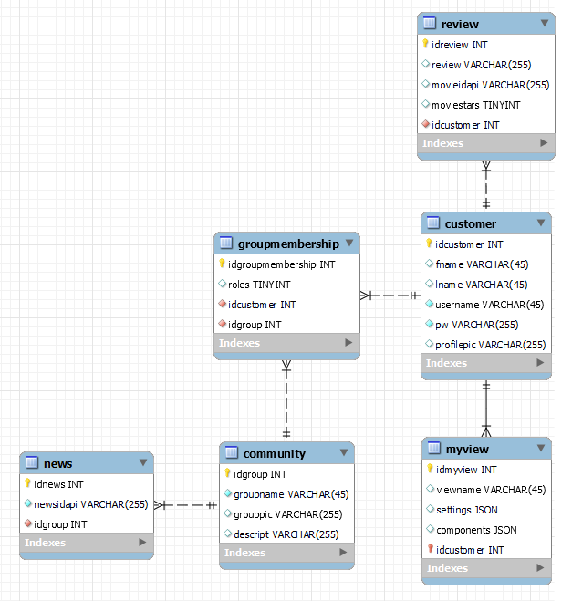
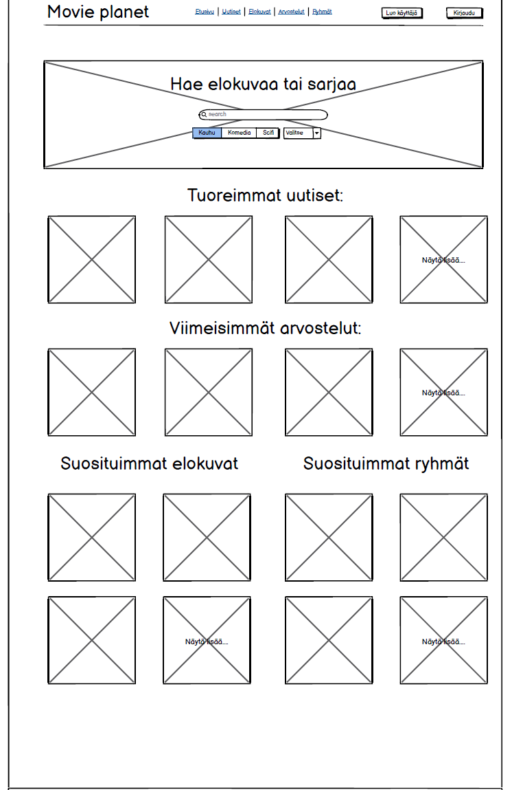

    Emilia Kumpuniemi - embsu
    Mikael Huotari    - Miklah1
    Sini Kykyri       - SiniKykyri
    Topi Ilmasti      - SUPPlS

# Websovellusprojekti MoviePlanet

Sovelluksen esittelyvideoon pääset [tästä](https://www.youtube.com/watch?v=4BdxWHJvRd4), ja palvelimelle [tästä](https://movieplanet.onrender.com/). 

## Johdanto
Projekti oli Oulun ammattikorkeakoulun (OAMK) tieto- ja viestintätekniikan 2. vuoden opiskelijoiden kehittelemä websivusto elokuvaharrastajien käyttöön. Projektiryhmään kuului neljä opiskelijaa Mikael Huotari, Topi Ilmasti, Emilia Kumpuniemi ja Sini Kykyri. Tehtävänä oli suunnitella ja toteuttaa vaatimusten mukainen websovellus. 

Sovelluksessa käyttäjä voi etsiä elokuvia, lukea elokuva-arvosteluja, lukea uutisia sekä selata ryhmiä. Halutessaan käyttäjä voi luoda käyttäjätunnuksen ja kirjautua sisään sovellukseen. Kirjautunut käyttäjä voi lisätä elokuva-arvosteluja sekä muokata käyttäjätietojaan tai poistaa käyttäjätunnuksensa. Kirjautunut käyttäjä voi myös luoda ryhmiä, lähettää liittymispyyntöjä ryhmiin ja jakaa uutisia kuulumiensa ryhmien sivuille. Ryhmän luonut käyttäjä voi hyväksyä tai hylätä liittymispyyntöjä sekä poistaa ryhmän jäseniä. 

## Käytetyt teknologiat
Backend on toteutettu käyttäen PostgreSQL-tietokantaa sekä Node.js-palvelinta. Frontend on toteuttu JavaScipt-kielellä React-kirjastoa hyödyntäen. Sovellus on julkaistu Render-pilvipalvelussa. Sovelluksessa hyödynnetään The Movie Databasen sekä Finnkinon API-rajapintaa.

## Projektinhallinta
Projektinhallintatyökaluna käytettiin GitHubin Kanban-tehtävänhallintamenetelmää. Projekti aloitettiin tekemällä tietokannan ER-kaavio, käyttöliittymän suunnitelma sekä REST-dokumentaatio. Tämän jälkeen teimme tietokannan, backend-rungon sekä React-sovelluksen rungon. Jokainen projektiryhmän jäsen toimi fullstack-kehittäjänä omalla osa-alueellaan.

Mikaelin vastuulla oli luoda frontend-puolella komponentit ryhmien näyttämiselle, uuden ryhmän luomiselle, ryhmien suodatetulle haulle sekä liittymispyynnöille. Nämä komponentit muodostavat ryhmät-sivun. Lisäksi Mikael teki komponentin, joka näyttää käyttäjien antamat elokuva-arvostelut. Backend-puolella Mikaelin vastuulla oli community-taulun endpointit. 

Topin vastuulla oli luoda frontend-puolella komponentit viikon suosituimpien elokuvien näyttämiseen, elokuvien hakemiseen erilaisilla suodatuksilla. Backend-puolella vastuulla oli review-taulun endpointit sekä The Movie Database APIn hallinta.

Emilian vastuulla oli luoda frontend-puolella komponentit etusivulle, navigointipalkille, elokuva-arvostelujen lisäämiselle, ryhmien liittymispyyntöjen käsittelylle, ryhmän jäsenten hallinnalle, käyttäjätietojen muokkaamiselle sekä varmistaa sivuston responsiivisuus. Backend-puolella vastuulla oli groupmembership-taulun endpointit.

Sinin vastuulla oli luoda frontend-puolella komponentit ryhmän omalle sivulle, uutiset-sivulle ja käyttäjän rekisteröitymiselle, kirjautumiselle sekä poistamiselle. Backend-puollella vastuulla oli news-taulun sekä kirjautumisen endpointit.

## Sovelluksen dokumentaatio
### Tietokantarakenne

Tietokannan rakenne on kuvattu oheisessa ER-kaaviossa (kuva 1). Teimme taulut tarpeellisille tietueille. Taulujen väliset suhteet on tehty vastaamaan sovelluksen vaatimuksia ja suhteet auttavat hahmottamaan, miten eri osat tietokannassa liittyvät toisiinsa.  Tietokantaan tallennamme esimerkiksi käyttäjätietoja ja elokuva-arvosteluja.

KUVA 1. Tietokannan ER-kaavio

### Käyttöliittymä
Kuvassa 2 sovelluksen etusivun suunnitelma. Halusimme etusivulle käyttäjäystävällisen, kompaktin ja selkeän näkymän, josta käyttäjä näkee, mitä erilaisia toiminnallisuuksia sivulla on. Valmiin sovelluksen etusivun toteutus näkyy kuvassa 3.

KUVA 2. Suunnitelma etusivusta

KUVA 3. Valmis toteutus etusivusta  
                      
## Loppupäätelmät
Projektissa haastavaa oli suunnitella kokonaisuus ilman aikaisempaa kokemusta laajemmasta verkkosovelluksesta. Jälkikäteen pohdittuna olisi asioita, jota tekisimme toisin, esimerkiksi tietokannan rakenne, komponenttien suunnittelu ja uudelleenkäytettävyys. Ajanpuutteen vuoksi koodin refaktorointi on hieman puutteellinen. 

Puutteista huolimatta olemme tyytyväisiä websovellusprojektiimme. Yhteistyö ryhmän jäsenten kesken toimi loistavasti ja saimme aikaan toimivan sovelluksen, joka täyttää arviointikriteerit. 
